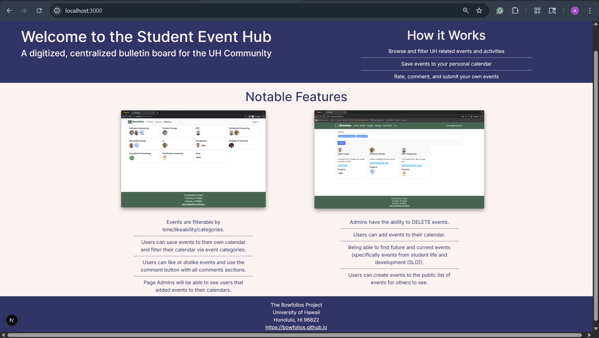
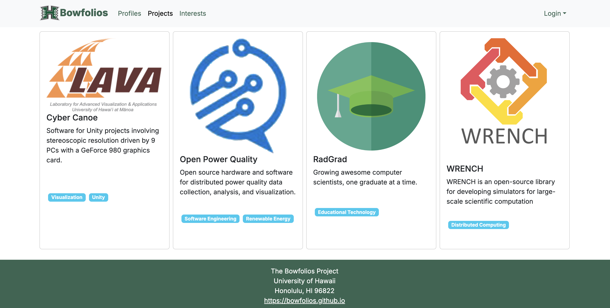
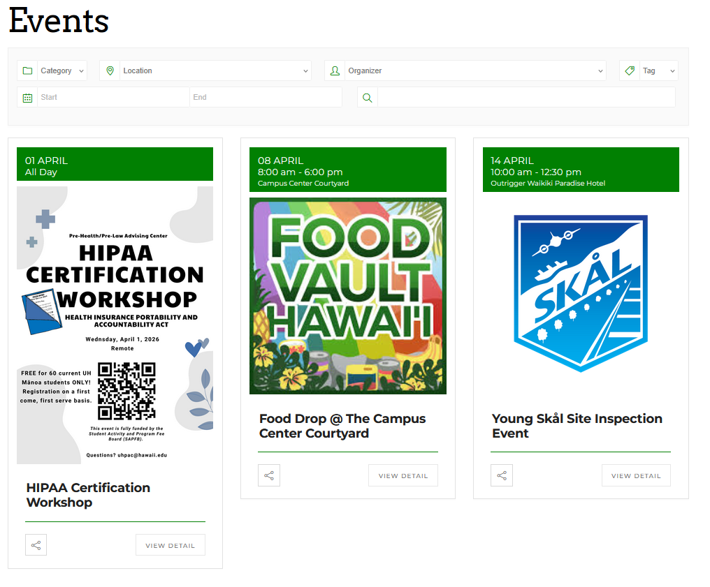
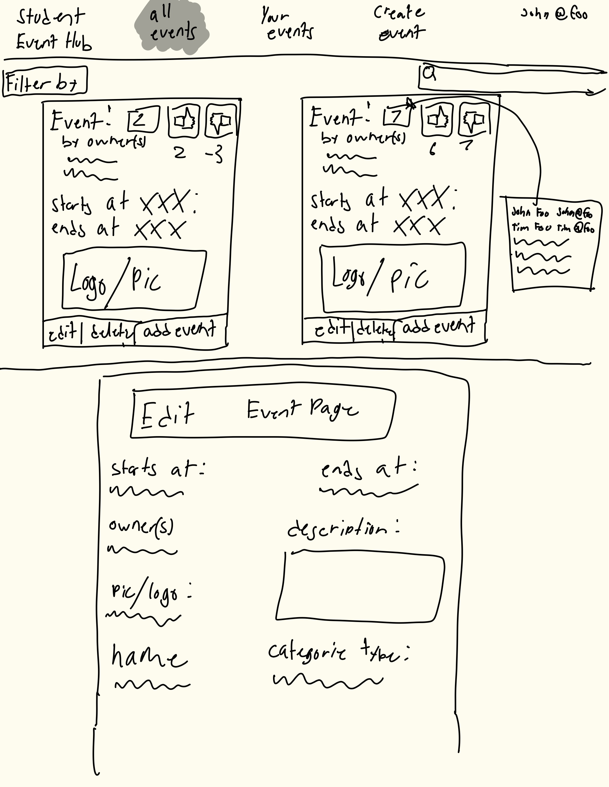
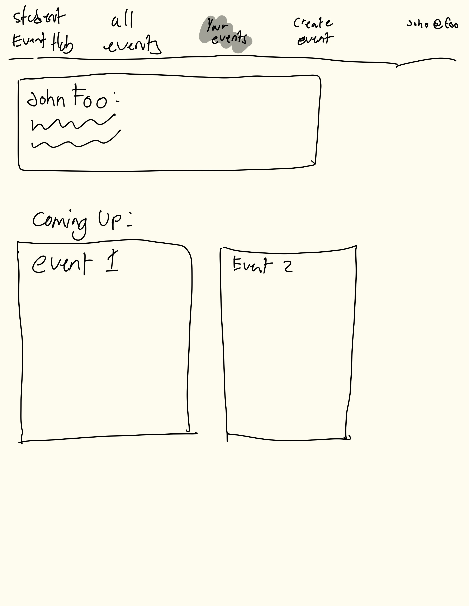
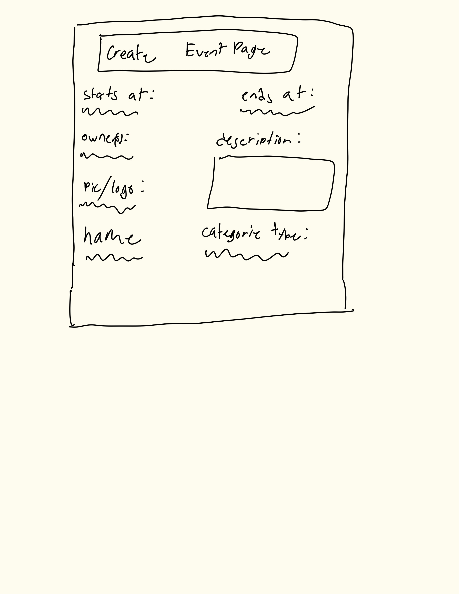
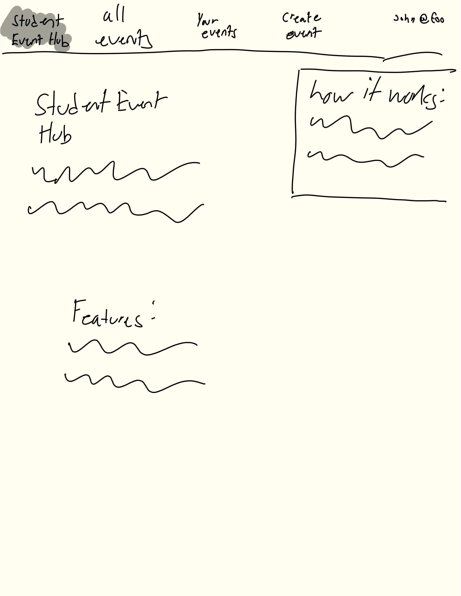

# Student Event Hub - Overview

## The Problem
Students have trouble finding events on Campus, students are busy and need reminders. Need digitalized calendar board

## Solution
Create a digitized calendar board to help users to keep track of and find SLE Events, through adding events to their calendar, finding events through filtering, reviewing events, and finding current and future events.

## Team
Jayden Cruz, Ahron Natividad, Kadon Nakano, Philip Low

# Our Approach
Student Events will include the time that each event will occur, a review system (Like/Dislike or Review by comment section), the place of event, description, categories, owner, and buttons to add to each user’s calendar

# Deployment
Here is our Vercel link to our deployment:
<a href = "https://student-event-hub.vercel.app/" >Student Hub</a>

# M1 Project
<a href = "https://github.com/orgs/student-event-hub/projects/1">M1</a>

# M2 Project 
<a href = "https://github.com/orgs/student-event-hub/projects/2"> M2 </a>

# Updates:

# Goals of Implementation
- Events are filterable by time/likeability/categories 
- Each User has their own component, “Your Events Page”, which users can events to their own calendar and filter their calendar via event categories
- Each User can review an event in the Your Events Page with a like/dislike button and/or comment button with all comments sections
- Page Admins will be able to see users that added events to their calendars in the All Events Page
- Admins can DELETE events from All Events Page and User’s Event Page
- Users can add events to their calendar
- Being able to find future and current events (specifically events from student life and development (SLD))
- Users can create events to the public list of events for others to see
 

# Mockup Page Ideas
- Home Page
- Create Event Page (to All Events Page)
- Edit Event Page
- All Events Page (add events to Your Events Page)
- Your Events Page
- Log in/Signup Page

- This image is a link to an already existing student life events webpage (https://manoa.hawaii.edu/studentlife/events/)
- And these other images below is our modern mockup page created by one of our team members to simulate how the website will be expanded

